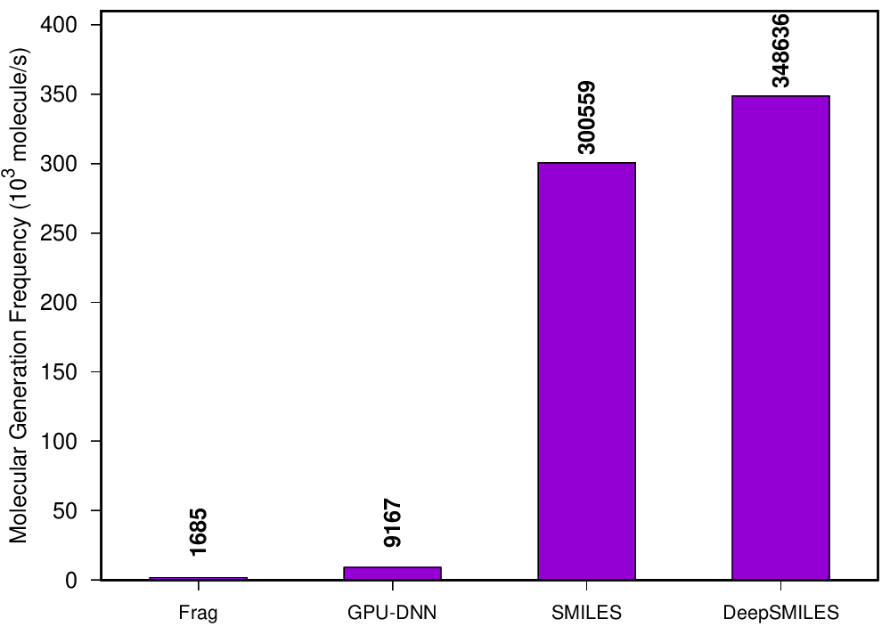

# FASMIFRA

Reference implementation for the article
"Molecular Generation by Fast Assembly of (Deep)SMILES Fragments".
Generate molecules fast from a molecular training set while also
doing training-set distribution matching.



# Installing the software

On Linux, you need python3-rdkit to be installed.

For OCaml programmers, you can clone this repository
then type 'make && make install'.
Note that you need to have opam installed and configured.

For end-users:
```bash
sudo apt install opam
opam init
eval `opam config env`
opam install fasmifra
```

For programmer end-users, or if the opam package is not ready yet:
```bash
sudo apt install opam
opam init
eval `opam config env`
opam pin add fasmifra https://github.com/UnixJunkie/FASMIFRA.git
```

We are currently working on an automated self-installer; stay tuned.

# Fragmenting molecules

Those molecules are your "molecular training set".

```bash
fasmifra_fragment.py -i my_molecules.smi -o my_molecules_frags.smi
```

If you fragment rather small molecules, you might want to use the -w option
and pass a smaller recommended fragment weight than the default (150 Da).

```
usage: fasmifra_fragment.py [-h] [-i input.smi] [-o output.smi] [--seed SEED]
                            [-n NB_PASSES] [-w FRAG_WEIGHT]

fragment molecules (tag cleaved bonds)

optional arguments:
  -h, --help      show this help message and exit
  -i input.smi    molecules input file
  -o output.smi   fragments output file
  --seed SEED     RNG seed
  -n NB_PASSES    number of fragmentation passes
  -w FRAG_WEIGHT  fragment weight (default=150Da)
```

# Generating molecules from fragments

```bash
fasmifra -n 100000 -i my_molecules_frags.smi -o my_molecules_gen.smi
```

```
usage:
  fasmifra
  -n <int>: how many molecules to generate
  -i <filename>: smiles fragments input file
  -o <filenams>: output file
  [--seed <int>]: RNG seed
  [--deep-smiles]: input/output molecules in DeepSMILES no-rings format
```

# FASMIFRA in the GuacaMol benchmark

|Benchmark    |Random sampler|SMILES LSTM|Graph MCTS|AAE  |ORGAN|VAE  |FASMIFRA|Negative control|
|-------------|--------------|-----------|----------|-----|-----|-----|--------|----------------|
|Validity     |1.000         |0.959      |1.000     |0.822|0.379|0.870|1.000   |1.000           |
|Uniqueness   |0.997         |1.000      |1.000     |1.000|0.841|0.999|0.994   |0.959           |
|Novelty      |0.000         |0.912      |0.994     |0.998|0.687|0.974|0.702   |0.947           |
|KL_divergence|0.998         |0.991      |0.522     |0.886|0.267|0.982|0.959   |0.855           |
|FCD          |0.929         |0.913      |0.015     |0.529|0.000|0.863|0.814   |0.397           |

# Bibliography

[1] Berenger, F., & Tsuda, K. (2021).
"Fast Molecular Generation by Assembly of (Deep)SMILES Fragments".
Submitted manuscript.

[2] O'Boyle, N., & Dalke, A. (2018).
"DeepSMILES: an adaptation of SMILES for use in machine-learning of chemical structures".
chemrxiv.org

[3] Weininger, D. (1988). SMILES, a chemical language and information system.
"1. Introduction to methodology and encoding rules".
Journal of chemical information and computer sciences, 28(1), 31-36.
